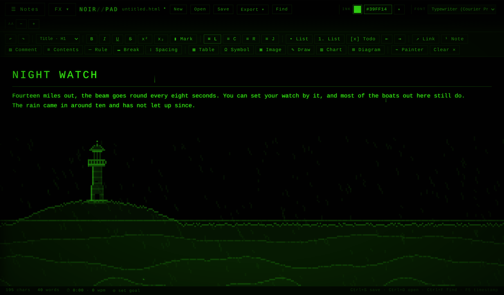
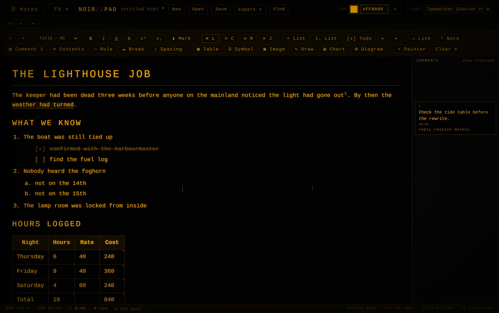
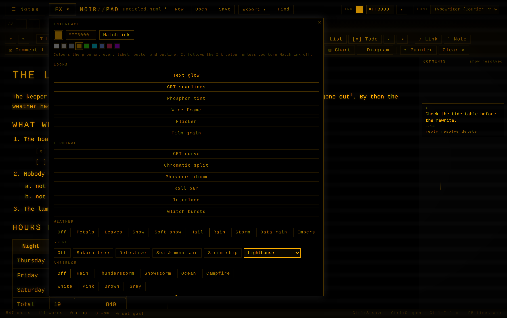

# NoirPad

A browser based word processor with a CRT aesthetic. One HTML file, no build step, no
dependencies, no server. Open it and write.



It looks like a terminal from 1983 and works like a word processor from now: styles,
tables with real formulas, footnotes, margin comments, a table of contents that keeps
itself current, and a genuine `.docx` export that Word opens without complaint.

---

## Run it

Download `NoirPad.html` and double click it. That is the whole installation.

It runs entirely in the browser from a `file://` URL. Nothing is uploaded, nothing phones
home, and it works with the network unplugged. The only outside request is a Google Fonts
link for the two display faces, and it falls back to Courier New if that is blocked.

To keep it on hand, pin the tab or make a desktop shortcut to the file.

Tested on Chrome, Edge and Firefox. Chromium based browsers get the best of it, since a
few effects lean on `color-mix` and the File System Access API.

---

## Writing



**Text.** Bold, italic, underline, strikethrough, superscript, subscript, highlight in
eight colours, text colour, links, horizontal rules, page breaks. Six paragraph styles
(body, three headings, quote, code block) on `Ctrl+Alt+0` through `3`.

**Lists that behave.** Tab nests an item under the one above it. Shift+Tab lifts it a
level and it takes the numbering of the list it rejoins, so a bullet under a numbered item
becomes the next number rather than staying a bullet. Markers step by depth the way Word
does them. Enter splits an item at the right level, Enter on an empty item steps out, and
Backspace at the start of an item outdents instead of merging it upward.

**Checklists.** `Ctrl+Shift+9`, or type `[] ` at the start of a line. Click a box to tick
it. The box is literal `[x]` text, so it survives every export intact.

**Markdown starts.** At the beginning of a line, `- ` or `* ` begins a bullet list, `1. `
a numbered one, `[] ` a checklist, `[x] ` a ticked one, `# ` through `###### ` a heading,
and `> ` a quote.

**Autocorrect.** Curly quotes, `--` to an en dash and never an em dash, `...` to an
ellipsis, `(c)` `(r)` `(tm)`, fractions, arrows, about thirty common typos, the doubled
capital fix, sentence capitals. One Backspace straight after a substitution puts the
literal characters back. Toggle in FX under Writing.

**Find and replace.** `Ctrl+F`. Case sensitive, whole word, and full regex with `$1` to
`$9` in the replacement.

**Format painter.** `Ctrl+Alt+C` to pick up a look, `Ctrl+Alt+V` to paint it, or click
`⌁ Painter` and then select what to paint. `Ctrl+Space` clears formatting.

---

## Tables

Insert any size, add and delete rows and columns, promote a header row.

**Formulas.** A cell whose text starts with `=` is a formula. The source lives on the
cell, the value is what you see, and the two swap as the caret moves in and out.

```
=SUM(B2:B10)        =AVERAGE(C1:C20)      =B2*1.08
=IF(B2>B3,"over","under")                 =ROUND(D4/D5*100, 1)
```

SUM, TOTAL, AVERAGE, COUNT, COUNTA, MIN, MAX, MEDIAN, PRODUCT, ROUND, ROUNDUP, ROUNDDOWN,
ABS, SQRT, INT, POWER and IF, plus `+ - * / ^ %`, parentheses and comparisons. A1 style
references with the header as row 1. Currency symbols, thousands separators, percentages
and `(123)` negatives all read as numbers. Bad formulas show `#DIV/0`, `#NAME`, `#ERR` or
`#CYCLE` rather than breaking the table. There is no `eval` anywhere in it; the parser is
hand written.

Four one click buttons build the common ones: sum the column above, sum the row to the
left, add a totals row, add a totals column.

**Sorting** by the caret's column, ascending or descending, with any row containing a
formula pinned at the bottom so a totals row is never shuffled into the middle.

**Excel and Sheets.** Paste a table and it stays a table, merged cells included. Paste
tab separated text and it becomes one. Copy a table out and it lands in Excel as cells,
not as one blob. Text to table and table to text both work the way Word's do.

---

## Things you can put in a document

**Charts.** Twelve types: column, bar, stacked, line, area, scatter, pie, donut, radar,
pyramid, funnel, gauge. Series are told apart by hatch pattern, marker shape and dash
pattern rather than by hue, so they survive colourblindness, a monochrome palette and a
black and white printer. Pull the numbers straight out of a table in the document.

**Diagrams.** Fifteen shapes: pyramid, funnel, layers, process, cycle, timeline, org
chart, mindmap, flowchart, 2x2 matrix, Venn, concentric rings, comparison columns,
fishbone, honeycomb. Written as plain text, one item per line, and rendered as inline SVG
so the labels stay real text and recolour with the ink.

**Drawings.** A pen, line, arrow, rectangle, ellipse and eraser on a 900x520 canvas.
Drawings are stored as strokes rather than pixels, so double clicking one reopens it for
editing even after a save and reload.

**Images** from a file, a paste or a drag and drop.

**Symbols.** A searchable picker: arrows, maths, box drawing, currency, Greek, dingbats.

**Footnotes.** `Ctrl+Alt+F` drops a marker and a numbered note at the foot of the
document. Move the markers around and the numbering follows.

**Margin comments.** Select text and press `Ctrl+Alt+M`. A numbered card appears in a rail
beside the writing. Reply, resolve, delete. They export as real Word comments.

**Table of contents.** One click, and then it rebuilds itself as you write. No "update
field" step. In the `.docx` it becomes a proper TOC field so Word can add page numbers.

---

## Getting work out

| Format | What you get |
| --- | --- |
| `.docx` | A real Word file: proper heading styles, numbered and bulleted lists, tables, pictures, page breaks, footnotes and comments. Hand built OOXML, no library. |
| `.doc` | The older HTML flavoured Word file, for anything that chokes on the real thing. |
| `.pdf` | Through the print dialog, dark on white, page breaks honoured. |
| `.html` | Keeps the dark look and stays editable if you reopen it in NoirPad. |
| `.rtf` | Opens anywhere. |
| `.md` | Markdown, with nested lists, checkboxes, footnotes and tables. |
| `.txt` | Plain text, or a 72 column teletype version with a header. |
| `.csv` | The tables, or numbered lines. |
| `.json` | Text, markdown and stats together. |
| `.png` | A screen capture with the phosphor still on it. |
| `.zip` | Every note, every folder and your settings, plus a readable copy of each note. |

Markdown and plain text can also go straight to the clipboard.

---

## Keeping notes

A drawer holds every note you have written, searchable across all of them, sortable, and
organised into folders. Three tabs:

- **Notes** for the list itself
- **Outline** for the headings in the current note, as jump targets
- **History** for earlier versions of the current note, with a preview and a restore

Everything autosaves to `localStorage`. Charts and drawings are stored as their spec
rather than their pixels, which took one test note from 322 KB of image data down to 2 KB,
and they are rebuilt on load.

---

## The look



Everything below lives behind the **FX** button, next to the notes drawer.

**Interface colour.** One picker paints the whole program: every label, button, border and
panel. By default it matches your ink colour and follows it, so changing the ink repaints
the app. Turn Match ink off to give the interface a colour of its own.

**Ink colour** for the writing, with presets and a hex box, applied to a selection or to
the whole document.

**Eleven fonts**, from Courier Prime and Lucida Console through to Times New Roman and
Aptos.

**Looks:** text glow, CRT scanlines, phosphor tint, wire frame, flicker, film grain.

**Terminal:** CRT curve, chromatic split, phosphor bloom, roll bar, interlace, glitch
bursts.

**Weather** across the page: petals, leaves, snow, soft snow, hail, rain, storm with
lightning, data rain, embers.

**Twenty two pixel scenes** drawn on canvas, all animated:

sakura tree · detective at the typewriter · sea and mountain · storm ship · jungle tiger ·
Sisyphus · desert caravan · desert highway · Icarus · cypress swamp · bamboo grove with a
panda · redwoods · open dunes · cherry blossom · cyber city · snow bank · snowy forest ·
wolf on a ridge · lighthouse · rain on a window · murmuration · campfire

**Ambience** through the Web Audio API, generated rather than sampled: rain, thunderstorm,
snowstorm, ocean, campfire, and white, pink, brown and grey noise. Plus typewriter key
sounds.

**Zen mode** on `F9` hides everything but the words. Typewriter scroll keeps the line you
are on in the middle of the screen. A block cursor if you want one.

---

## Keyboard

| | |
| --- | --- |
| `Ctrl+S` `Ctrl+O` `Ctrl+Alt+N` | Save, open, new note |
| `Ctrl+B` `Ctrl+I` `Ctrl+U` | Bold, italic, underline |
| `Ctrl+Alt+0` … `Ctrl+Alt+3` | Body, H1, H2, H3 |
| `Ctrl+Shift+L` `E` `R` `J` | Align left, centre, right, justify |
| `Tab` / `Shift+Tab` | Nest or lift a list item |
| `Ctrl+Shift+9` | Checklist |
| `Ctrl+K` | Link |
| `Ctrl+Enter` | Page break |
| `Ctrl+Alt+F` | Footnote |
| `Ctrl+Alt+M` | Comment on the selection |
| `Ctrl+Alt+C` / `Ctrl+Alt+V` | Format painter: pick up, paint |
| `Ctrl+Space` | Clear formatting |
| `Ctrl+Shift+D` `G` `I` | Drawing, chart, diagram |
| `Ctrl+F` | Find and replace |
| `Ctrl+Shift+V` | Paste without formatting |
| `Ctrl+Shift+8` | Formatting marks |
| `Shift+F3` | Cycle the case of a selection |
| `F5` | Insert a timestamp |
| `F9` | Zen mode |

---

## Your writing stays yours

Notes live in your browser's `localStorage` and nowhere else. There is no account, no
sync, no telemetry and no network call that carries your text. Pasted HTML is cleaned in
an inert document before it touches the page, so nothing in a paste can fetch anything or
run. Use Save to keep a real file, and the backup `.zip` to move everything to another
machine.

---

## Working on it

`NoirPad.html` is the whole program. Around 620 KB: one `<style>` block, the markup, and
one `<script>` holding an IIFE. No build, no bundler, no package manager. Edit it in any
text editor, reload the page, and that is the whole loop.

If you want to poke at the internals, everything hangs off a handful of CSS custom
properties on `:root`. `--ink` is the writing, `--ui` is the program around it, and every
chrome colour in the stylesheet is a `color-mix` of one of those two.

---

## Licence

MIT. Do what you like with it.
